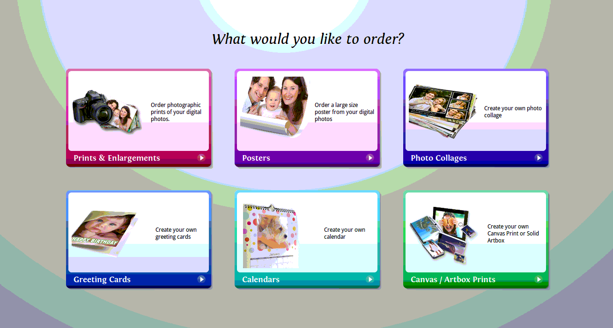

# Changing name of PrismGift Element on Kiosk Homescreen.

##### Client: Costco UK
##### Created Date: 19.08.15
##### Author: Davy Jones (TS)

--------

## 1. The Symptom

On the main screen on a few Costco Remote kiosk. It was seen that The Bottom Right Tile was name 'Canvas / Artbox Prints' instead of the expected 'Canvases and Gifts'. See image below:

## 2. The Why

The default value for this is being overwritten within `/home/share/SharedFolders/Config/Services/PrismGift`.

Within this folder was a file named `info.ini` with the following contents:

> [Service]
> Title=Canvas / Artbox Prints
> Description=Create your own Canvas Print or Solid Artbox

Unsure why this is getting pulled in but will investigate further

## 3. The Fix

rename the file by running: `mv info.ini info.ini.bk`
Technically you can just remove the file but best kept until origin can be assertained.
