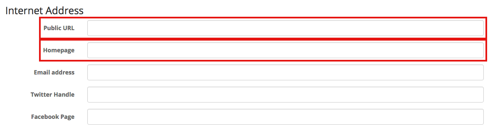
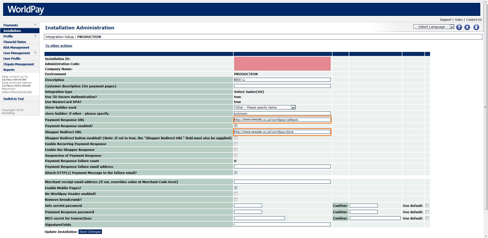

# Problem Updating Rails3 Sites
##### Created Date: 16.11.15
##### Authors: Davy Jones

# Intro

This document describes the process of transferring a customers Web Kiosk domain from one to another and what files need to be changed.

These are experiences I have had while moving DS Colour from their dscolour.photokio.sk (1) domain to dscolourlabs.co.uk (2).

# Things to consider

- There will be disruption to their site during the migration, but hopefully the process outlined below will mitigate the impact of that.
- Find out who the DNS admin is for the relevant domains and get in contact with them to discuss process.
- Is the customer concerned about SEO related stuff? If so then we may need to create a bunch of rewrites in the web server config file.

# Making changes to site

### Set up 302 (temporary) redirect from old site to new one. 

So this is going to be from an NGINX perspective but it's pretty easily googled if using Apache or another. We will write to config but not enable it until we're ready to go.

We use 302's instead of 301's as a protection in case it goes wrong. Differences outlined here: [301 HTTP Response](https://en.wikipedia.org/wiki/HTTP_301) vs [302 HTTP Response](https://en.wikipedia.org/wiki/HTTP_302)

The config will look something like this:

```
server {
        listen 80;
        server_name .old.photokio.sk;
        return 302 http://new.co.uk$request_uri;
}

server {
        listen 80;
        server_name  new.co.uk; 
        root   /path/to/sites/public;
        passenger_enabled on;

        location / {
            root /path/to/sites/public;
            passenger_enabled on;
            index  index.html index.htm;
        }

        error_page   500 502 503 504  /50x.html;
        location = /50x.html {
            root   html;
        }
}
```

In a nutshell we have 2 servers old.photokio.sk and new.co.uk . Requests for new.co.uk are served by the root path and this is normal behaviour. Requests for old.photokio.sk don't get served but are instead given a 302 response and directed to go to new.co.uk. The `$requst_uri` at the end of the return method allows anything after the / to be retained in the redirect. Without this then all would just go to the root of new.co.uk .

With this added we can check it by making the config readable but not active running:

```
sudo mv old.photokio.sk old.photokio.sk.orig
sudo mv old.photokio.sk.new old.photokio.sk
sudo /etc/init.d/nginx configtest.
```
It should return `...done.`

Please note that unless you reload nginx this config is not fully live. I would put the above lines into a script to improve speed and reduce errors. Return the config for the site to its original state.

### Change settings in mylab

Within Preferences and Lab Settings in the Mylab of the site we need to change the `Public URL` and the `Homepage` links to be for the new site, see image below.



### Change WorldPay Config



# References

[Original WorldPay Integration Documentation](https://sites.google.com/a/livelinktechnology.net/intranet/home/worldpay-redirect-after-payment)
